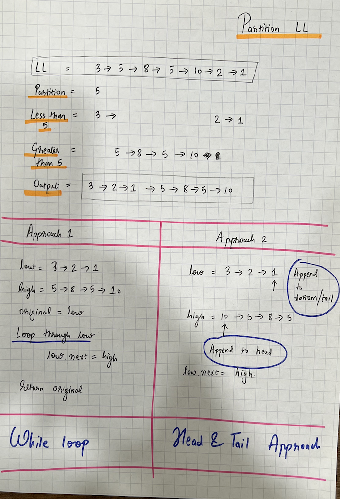

#  Partition Linked List

## Problem Statement

Given the head of a linked list and a value x, partition it such that all nodes less than x come before nodes greater than or equal to x.

```agsl

Input: head = [1,4,3,2,5,2], x = 3
Output: [1,2,2,4,3,5]
Example 2:

Input: head = [2,1], x = 2
Output: [1,2]

```

## Hint

Consider maintaining two separate linked lists, 
* one for nodes less than x and 
* the other for nodes greater than or equal to x.



## Code

```java
public static ListNode partition(ListNode head, int x) {

    if (head == null) return head;
    if (head.next == null) return head;
    ListNode lessThanX = null;
    ListNode moreOrEqualToX = null;

    ListNode headLessThanX = null;
    ListNode headMoreOrEqualToX = null;

    while (head != null) {
        if (head.val < x) {
            if (lessThanX == null) {
                lessThanX = new ListNode(head.val);
                headLessThanX = lessThanX;
            } else {
                lessThanX.next = new ListNode(head.val);
                lessThanX = lessThanX.next;
            }
        } else {
            if (moreOrEqualToX == null) {
                moreOrEqualToX = new ListNode(head.val);
                headMoreOrEqualToX = moreOrEqualToX;
            } else {
                moreOrEqualToX.next = new ListNode(head.val);
                moreOrEqualToX = moreOrEqualToX.next;
            }
        }
        head = head.next;
    }
    if (lessThanX == null) return headMoreOrEqualToX;
    lessThanX.next = headMoreOrEqualToX;
    return headLessThanX;
}
```

## Time Complexity
The time complexity of the solution is O(n),
where n is the length of the linked list. 

The algorithm traverses the entire linked list once.

## Space Complexity
The space complexity of the provided solution is O(n), where n is the length of the linked list. This is because the algorithm maintains two separate linked lists (lessThanX and moreOrEqualToX) to store nodes based on the given condition. The space required for these two lists is directly proportional to the number of nodes in the original linked list.

Additionally, the algorithm uses constant space for other variables (like pointers and temporary nodes), and the space required for these remains constant regardless of the input size.

Therefore, the overall space complexity is O(n).