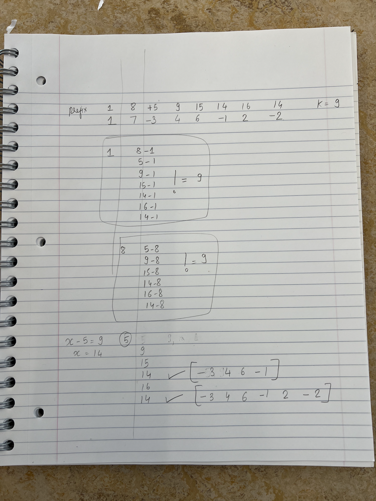

# Subarray Sum Equals K

## Question

Given an array of integers `nums` and an integer `k`, return the total number of continuous subarrays whose sum equals `k`.

```
        a_0560_subArrayEqualsK class1 = new a_0560_subArrayEqualsK();

        //int[] arr_i_input = {10, 20, -20, 40, 30, 10, 10, 10, 10};
        //int[] arr_i_input = {-1, -2};
        //int[] arr_i_input = {5,7};
        //int [] arr_i_input = {-1,-1,1};
        int [] arr_i_input = {0,0};

        System.out.printf("Sub array: " + class1.subarraySum(arr_i_input, 0));
        //System.out.printf("Sub array: " + class1.combinationSum(new int[]{2,3,6,7}, 7));
        //System.out.printf("Sub array: " + class1.combinationSum(new int[]{2,3,5}, 8));
        //System.out.printf("Sub array: " + class1.combinationSum(new int[]{2,7, 6, 5}, 16));
```

## Constraints

- The length of the array is at least 1 and does not exceed 20000.
- The value of each element in the array is between [-1000, 1000].
- The length of the array won't exceed 10,000.

## Hints



## Answer

```java
public int subarraySum(int[] nums, int k) {

    if(nums.length == 1) return nums[0] == k ? 1 : 0;
    int[] arr_i_input = {-1, -1, 1};

    int counter = 0;
    int[] prefix_sum = new int[nums.length];
    prefix_sum[0] = nums[0];

    for(int j = 1; j < nums.length; j++){
        prefix_sum[j] = prefix_sum[j-1] + nums[j];
        if(prefix_sum[j] == k){
            counter++;
        }
    }

    for(int j = 0; j < nums.length; j++){
        for(int l = j+1; l < nums.length; l++){
            if((prefix_sum[l] - prefix_sum[j]) == k){
                counter++;
            }
        }
    }

    return counter;

}
```
